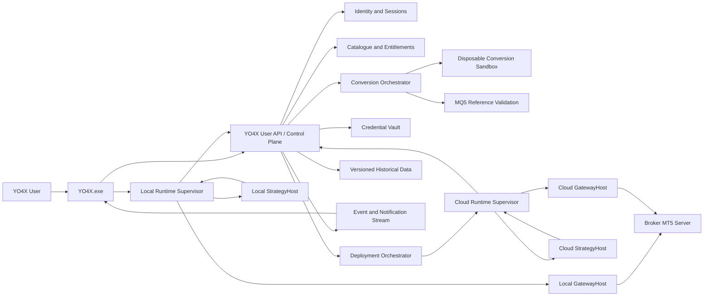

# YO4X User-Side Architecture

**Status:** Corrected target-state architecture; only Phase U0 is active. V1A and all live/local/import releases remain gated  
**Scope:** User-facing Windows application, user-facing platform services, local execution, and paid 24/7 cloud execution  
**Excluded:** Admin UI design, internal catalogue-management screens, finance operations, and final payment-provider selection. Required operational controls are still identified because the user-side system cannot run safely without them.  
**Companion document:** [YO4X Admin-Side Architecture](./ADMIN_SIDE_ARCHITECTURE.md)  
**Active execution plan:** [YO4X Phase U0 Execution Plan](./PHASE_U0_EXECUTION_PLAN.md)  

## 1. Executive decision

YO4X will not execute MQ5 or EX5 files directly. MQ5 is accepted only as source for compatibility analysis and conversion into one of two reviewed runtime formats:

- **YO4X-reviewed strategies:** Signed C# packages created or manually approved by YO4X.
- **User-imported strategies:** Signed packages containing restricted YO4X Strategy IR, executed by the YO4X interpreter rather than as arbitrary user-derived .NET assemblies.

The execution path is:

```text
Reviewed C# or interpreted Strategy IR
    -> YO4X exposure-aware licensing and risk pipeline
    -> licensed MT5 gateway dependency
    -> broker MT5 server
```

No MetaTrader terminal is required for **production execution** in either operating mode:

- **Local:** The strategy worker runs on the user's Windows PC.
- **YO4X Cloud 24/7:** The same strategy worker runs in YO4X infrastructure and continues when the user's PC is off.

An isolated MT5 reference environment may be used only during conversion validation, or the user may run the reference validator in their own MT5 installation. This does not become part of local or 24/7 production execution.

The user-facing product calls these items **Strategies**, not EX5 files. EX5 is not accepted as an executable strategy format.

Automatic conversion is a supported-subset feature, not a promise that every valid MQ5 program can be converted. Unsupported or ambiguous behavior stops with an exact finding and never becomes live-trading code through guesswork.

### 1.1 Production go-live gates

Production and live-account features remain disabled until all gates pass:

1. Written commercial rights for `mt5api.dll`, covering the intended local and cloud distribution models.
2. Verification that the exact DLL is a full production build, does not proxy credentials through vendor infrastructure, and has a supported update/security process.
3. Approved MQ5 supported-subset and event-semantics specification.
4. A working reference-validation method for the original MQ5.
5. OS-level isolation and resource fencing for every user-derived conversion job and strategy worker.
6. Historical-data provenance and reproducible simulation datasets.
7. Exposure-aware expiry, disconnect, and open-position policies.
8. Broker/account-mode capability matrix, including hedging, netting, authentication, and order semantics.
9. Credential threat model, broker-terms review, privacy review, and jurisdiction-specific legal review.
10. Demo soak, failure-injection, duplicate-order, recovery, and security gates.

## 2. Architecture principles

1. **Safety before strategy:** In the official runtime, strategies receive no direct broker path; they create requested actions that pass licensing, risk, audit, and idempotency controls. A modified owner-controlled local runtime remains outside this guarantee.
2. **One runtime contract:** Local and cloud modes execute the same signed strategy version with the same parameters.
3. **Server-authoritative licensing:** The desktop application displays entitlements, but the backend is the authority.
4. **Secrets are never ordinary application data:** Broker passwords never enter logs, analytics, crash reports, SQLite, or source-controlled configuration.
5. **Broker state is authoritative:** After reconnect or restart, YO4X reconciles with the broker before sending another order.
6. **Fail closed:** Stale quotes, uncertain state, expired licensing, or missing risk information block new entries.
7. **Modular first:** Begin with a modular backend and isolated workers; split services only when scale requires it.
8. **Explicit ownership:** Every order and position must be attributable to one user, broker account, deployment, strategy version, and intent.
9. **No silent live trading:** Demo validation and a clear live-trading confirmation are mandatory.
10. **No performance promises:** Backtests and historical results are presented with assumptions and risk disclosures.
11. **Supported subset, never silent guessing:** Conversion stops when semantics cannot be mapped deterministically.
12. **Untrusted code is isolated:** Static analyzers supplement, but never replace, an OS/process security boundary.
13. **Reproducible data:** Every simulation and parity result identifies its data, symbol specification, converter, and runtime versions.
14. **Risk-reducing actions remain distinguishable:** Expiry or degraded state blocks increased exposure without accidentally blocking approved protection or reduction.
15. **No stealth dependencies:** Third-party binaries retain truthful provenance, license notices, pinned hashes, and auditable packaging.
16. **Local execution is an untrusted edge:** YO4X can authenticate official software and detect common tampering, but it cannot guarantee enforcement on a computer controlled by its owner.
17. **Interfaces are not sandboxes:** Strategy and gateway interfaces define software contracts; process/OS isolation provides the security and crash boundary.

## 3. Product scope

### 3.1 Target user-side scope across staged releases

The list below is the target product scope, not one release. Section 25 separates the vertical demo, controlled live pilot, local execution, and restricted MQ5 import.

- Email registration, verification, login, logout, and password recovery.
- Optional MFA and device/session management.
- Strategy catalogue and strategy details.
- Private **My Strategies** workspace.
- MQ5/MQH source upload, supported-subset compatibility analysis, assisted conversion, and demo validation.
- License/entitlement status.
- MT5 broker-account connection wizard.
- Local execution and paid 24/7 cloud execution.
- Strategy parameter and risk configuration.
- Start, pause, resume, close-only, stop, and emergency-stop controls.
- Connection, account, position, order, and execution monitoring.
- Activity history, audit-friendly explanations, and notifications.
- Secure application updates.
- Demo-to-live activation workflow.

### 3.2 Deliberately excluded from this phase

- Admin portal and internal strategy publishing workflow.
- Copy trading between users.
- Social feeds, leaderboards, or profit guarantees.
- Customer deposits, withdrawals, or custody of funds.
- Broker administration or MetaTrader Manager API functions.
- Public publishing or resale of user-imported strategies.
- EX5 uploads, binary-only indicators, and arbitrary DLL uploads.
- Multiple active strategies on one account in the MVP.
- Mobile trading application.
- Final billing-provider implementation.
- Fully automatic conversion of every valid MQ5 program.
- Direct execution of user-uploaded or generated arbitrary C# assemblies.

## 4. Operating modes

| Capability | Local mode | YO4X Cloud 24/7 |
|---|---|---|
| Strategy execution | User PC | YO4X worker infrastructure |
| MT5 terminal | Not required | Not required |
| Trading API | `mt5api.dll` | `mt5api.dll` |
| Runs while PC is off | No | Yes |
| Broker credential storage | Windows-protected local vault | Managed cloud secret vault |
| License validation | Short-lived online lease | Short-lived server lease |
| Strategy IP protection | Limited; compiled code reaches the PC | Stronger; code remains on YO4X infrastructure |
| Updates | Signed application/strategy update | Controlled worker deployment |
| Recommended usage | Evaluation and normal desktop use | Paid continuous execution |

The operating-mode claim depends on a commercially licensed production build of the gateway. Until that dependency is approved, both modes are prototype-only.

### 4.1 Mode-switching rule

A running deployment cannot switch between local and cloud execution. The user must:

1. Stop or move the source deployment to close-only.
2. Obtain an acknowledged source-worker shutdown, or wait for its signed lease to expire plus the documented clock-skew/conservative safety interval.
3. Reconcile all positions, pending orders, deals, and unknown commands.
4. Confirm the destination mode and the observed state of the old worker.
5. Issue a new generation from the linearizable ownership store only after the previous generation is no longer valid.
6. Start the destination in reconciliation-only mode.
7. Permit new exposure only after the destination proves account ownership, freshness, protection, and reconciliation.

This protocol reduces cooperative split-brain risk but cannot prove that a modified local process stopped sending directly to an MT5 broker. The UI says “YO4X has not observed the old worker” when shutdown is not acknowledged. Absolute broker-side fencing requires every broker command to pass through YO4X-controlled infrastructure.

### 4.2 MVP account-ownership rule

V1A through V1D permit only one active strategy deployment per MT5 account. This avoids conflicts involving:

- Netting versus hedging accounts.
- Two strategies modifying the same stop loss.
- Duplicate entries.
- Shared margin and daily-loss limits.
- Unclear ownership of manually opened positions.

Multi-strategy accounts require a later portfolio coordinator and are not part of the staged releases.

### 4.3 Strategy ownership and runtime class

| Strategy class | Ownership | Runtime | Local eligibility | Commercial rule |
|---|---|---|---|---|
| YO4X catalogue | YO4X/licensor | Reviewed signed C# or IR | Optional; cloud-only when IP protection is required | Strategy entitlement plus execution plan |
| User private import | User | Restricted signed IR by default | Allowed after validation | Conversion/execution service subscription; YO4X does not claim strategy ownership |
| Public third-party marketplace | Third-party author | Not in staged releases | Not in staged releases | Requires a later author, publishing, takedown, and revenue model |

Changing ownership class requires an explicit publishing/review process; a private upload never becomes public automatically.

### 4.4 Local execution trust statement

The local Windows environment is an untrusted execution edge. YO4X can authenticate official software and detect many forms of tampering, but it cannot guarantee that the device owner has not modified local execution. Local telemetry, licensing enforcement, and platform risk enforcement are authoritative only for an untampered official runtime and must be reconciled against broker state.

Product rules:

- Proprietary/high-value catalogue strategies may be cloud-only.
- Accounts requiring mandatory, non-bypassable platform policy enforcement are cloud-only.
- Local live mode, if introduced later, is described as user-controlled automation rather than centrally enforceable execution.
- Local reports are never accepted as authoritative financial, trading, or compliance evidence without broker reconciliation.
- Local mode is not used to enforce prop-firm or third-party rules unless every broker command passes through a YO4X-controlled gateway.
- A modified or old local client may bypass cooperative leases because the MT5 broker does not understand YO4X fencing tokens.
- Strong enforcement and strongest strategy-IP protection require YO4X-controlled cloud execution.

## 5. System context



The control plane manages identity, licensing, configuration, and lifecycle. Each trading data plane separates Supervisor/risk/journal, StrategyHost, and credential-bearing GatewayHost. StrategyHost has no direct path to the broker.

Conversion and reference validation are separate data planes. They never receive production broker credentials and cannot submit live orders.

## 6. User-side component model

### 6.1 `YO4X.exe` — Windows desktop client

Responsibilities:

- Authentication and account recovery screens.
- Strategy discovery and entitlement display.
- Broker-account onboarding.
- Deployment configuration and lifecycle commands.
- Live dashboards and activity views.
- Local-agent installation, health, and version checks.
- User notifications and support diagnostics.

The desktop client does **not**:

- Make strategy decisions.
- Send orders directly.
- Decide whether a license is valid.
- Store broker passwords in its local database.
- Treat cached data as authoritative trading state.

Recommended implementation:

- .NET 10 LTS.
- WPF with MVVM for a mature Windows-only desktop stack.
- Dependency injection and async commands.
- Self-contained x64 deployment.
- Signed installer and signed updates. MSIX is the preferred candidate, but the installer spike must validate background-agent/service behavior, elevation, minimum Windows version, and update safety. A signed WiX/MSI installer remains the fallback.

### 6.2 `YO4X.Agent.exe` — local runtime supervisor

The local runtime is split into three processes so UI, strategy, and gateway faults do not share one credential-bearing process:

```text
YO4X.Agent.exe          Runtime Supervisor
YO4X.StrategyHost.exe   Restricted strategy execution
YO4X.GatewayHost.exe    Vendor gateway and broker connection
```

V1C prefers a per-user background agent rather than a machine-wide Windows service. A service is adopted only if the installer/security spike proves that its additional privilege and upgrade complexity are justified.

Supervisor responsibilities:

- Obtain and renew a signed execution lease.
- Own deployment lifecycle, fencing generation, event ordering, risk policy, and durable journal.
- Verify and start one approved StrategyHost package.
- Start a dedicated GatewayHost without exposing its credential channel to StrategyHost.
- Normalize quotes, bars, account state, positions, and executions.
- Coordinate the deterministic event transaction.
- Apply mandatory risk policies.
- Submit only risk-approved normalized commands to GatewayHost.
- Reconcile broker state after startup and reconnect.
- Stream redacted status events to the desktop and backend.

Desktop-to-agent communication uses authenticated local IPC, preferably Windows named pipes with per-user access controls. The agent rejects commands from another Windows user or an unsigned/untrusted client.

Supervisor-to-host IPC is authenticated per runtime instance, sequence-checked, schema-versioned, and allowlisted by message type. These controls protect the official runtime from ordinary faults and attacks; they do not make an owner-controlled computer a trusted server.

#### 6.2.1 StrategyHost

StrategyHost:

- Runs restricted Strategy IR or a reviewed strategy built from source in YO4X-controlled CI.
- Receives normalized, read-only events and snapshots.
- Returns proposed state and requested actions.
- Has no broker credentials, raw MT5 gateway reference, or direct order API.
- Has no unrestricted network, filesystem, process, reflection, native-library, or thread capability.
- Runs with CPU, memory, state, event, and wall-time quotas in a low-privilege OS boundary.

YO4X never accepts a third-party precompiled DLL and simply labels it reviewed. Reviewed C# must have source review, reproducible build evidence, an exact package hash, and the same OS isolation principles as the restricted interpreter.

#### 6.2.2 GatewayHost

GatewayHost:

- Is the only process that loads `mt5api.dll`.
- Receives only normalized, risk-approved broker commands from Supervisor.
- Owns temporary broker-credential access and clears plaintext after connection use.
- Has broker/control-plane egress only; StrategyHost has no route to it.
- Returns normalized market, account, order, deal, position, and error events.
- Is restarted or replaced independently after crash, then reconciled before new exposure.

### 6.3 YO4X user control plane

Start as a modular ASP.NET Core application with clear internal module boundaries:

- **Identity module:** registration, email verification, authentication, MFA, recovery, sessions, devices.
- **User profile module:** preferences, timezone, consent records, notification settings.
- **Catalogue module:** user-visible strategy metadata and versions.
- **My Strategies module:** private user strategy records, import status, conversion findings, and ownership.
- **Entitlement module:** licenses, expiry, account bindings, execution-mode eligibility.
- **Broker account module:** connection metadata and encrypted credential references.
- **Deployment module:** validated configurations and lifecycle state.
- **Event module:** durable user-visible activity and real-time updates.
- **Notification module:** in-app, desktop, and email alerts.
- **Audit module:** security and trading-control events.

MQ5 uploads are never parsed, compiled, or executed inside the control-plane process. The control plane stores metadata and schedules work in a separate conversion service with disposable sandboxes.

### 6.4 YO4X cloud worker

The cloud runtime uses the same Supervisor, StrategyHost, and GatewayHost contracts. They run as separate strongly isolated processes or containers inside one account-level workload boundary. Differences are supplied by infrastructure adapters:

- Cloud secret-vault adapter instead of Windows Credential Manager.
- Server event transport instead of local named pipes.
- Central heartbeat and orchestration.
- Stronger process/container isolation.
- Automated worker replacement and recovery.

Use one isolated account-level workload per active broker account in the initial releases. StrategyHost and GatewayHost do not share credentials, writable storage, or unrestricted network access. This costs more memory than a shared process but gives a real fault and secret boundary.

Cloud workloads additionally require an OS/container isolation boundary, unique identities per component, a fencing token, memory/CPU/time quotas, and explicit egress. StrategyHost is network-denied. GatewayHost may reach only approved broker and control-plane endpoints. A .NET assembly or interface boundary alone is not a sandbox.

### 6.5 MT5 gateway boundary

All access to `mt5api.dll` is behind an internal interface such as `IMt5Gateway` and inside GatewayHost.

The gateway owns:

- Broker discovery.
- Login, connection timeout, and disconnect.
- Quote and bar subscriptions.
- Account snapshots.
- Position, order, deal, and history retrieval.
- Order placement, modification, cancellation, and closing.
- Error normalization.
- Reconnection and server failover.

No UI, Supervisor domain module, or strategy assembly references `mt5api.dll` directly. The interface makes the dependency testable and replaceable; GatewayHost provides the security and crash boundary.

### 6.6 Gateway dependency and provenance policy

`mt5api.dll` is a third-party commercial dependency, not a YO4X binary. It must not be renamed, metadata-rewritten, hidden for “stealth,” or presented as YO4X-owned.

YO4X exposes only its own facade, for example `YO4X.Trading.dll`. The vendor binary remains behind that facade with:

- Written license terms covering local redistribution, cloud/SaaS use, account limits, and updates.
- Proof that the exact artifact is a full production build rather than a trial.
- SHA-256 allowlisting and a software bill of materials.
- Malware/security review and network-behavior verification.
- Version compatibility tests and a rollback path.
- Vendor support and protocol-change SLA.
- Confirmation that production credentials connect directly to broker endpoints and are not relayed through vendor infrastructure.
- Source access or escrow preferred for a business-critical trading dependency.

Recommended layouts:

```text
Local, if redistribution is contractually permitted:
YO4X.exe
YO4X.Trading.dll
vendor/mt5api.dll

Cloud:
YO4X cloud worker
YO4X.Trading.dll
private vendor runtime/mt5api.dll
```

If the vendor grants source-modification and rebranding rights, YO4X may build a first-party-named adapter from licensed source while retaining required notices. Without those written rights, the vendor assembly identity and provenance remain unchanged.

## 7. Strategy package architecture

Each strategy becomes an immutable, versioned package. The payload depends on its runtime class.

```text
YO4X-reviewed C# package
├── strategy.manifest.json
├── YO4X.Strategy.<StrategyName>.dll
├── parameter-schema.json
├── optional signed resources
└── package signature and checksums

User-imported restricted package
├── strategy.manifest.json
├── strategy.ir
├── parameter-schema.json
├── optional validated data resources
└── package signature and checksums
```

User-derived arbitrary C# is never a deployable package type.

### 7.1 Required manifest fields

- Stable strategy ID.
- Name and semantic version.
- Minimum YO4X runtime version.
- Supported symbols or symbol patterns.
- Required timeframes.
- Required quote/bar/history depth.
- Timer requirements.
- Parameter schema, groups, defaults, validation rules, and stable parameter IDs.
- Position ownership/magic-number policy.
- Account-mode support: hedging, netting, or both.
- Minimum balance and leverage rules, if applicable.
- Risk-policy requirements.
- Runtime kind: `REVIEWED_DOTNET` or `RESTRICTED_IR`.
- Converter, IR, indicator-library, and event-semantics versions.
- Historical/reference validation evidence and limitations.
- Package hash and publisher signature.

### 7.2 Strategy contract

The strategy-facing contract is synchronous and deterministic. Initialization, tick, bar, timer, execution, account-change, and stop are typed events:

```csharp
public interface IYo4xStrategy
{
    StrategyResult Handle(
        StrategyEvent input,
        StrategySnapshot snapshot,
        StrategyState currentState);
}

public sealed record StrategyResult(
    StrategyState NextState,
    IReadOnlyList<RequestedAction> RequestedActions);
```

The snapshot contains only normalized market, indicator, account, position, order, clock, and configuration data fixed for that event. Strategy code cannot await external work, read wall-clock time, submit an order directly, or mutate durable state during the call.

User imports execute equivalent operations through the restricted IR interpreter. They do not implement or load this .NET interface directly.

### 7.3 Execution semantics

- One serialized event queue per deployment.
- Events ordered by receipt sequence; broker timestamps are data and do not reorder already received events.
- UTC used internally for all timestamps.
- No overlapping `OnTick`, timer, bar, or execution callbacks.
- Strategy evaluation is synchronous. Broker, storage, and control-plane I/O happens only after the event transaction commits.
- MQL5-compatible coalescing: if a NewTick event is queued or running, another NewTick is not queued; timer events follow the same rule.
- Trade/execution events are durable and are not intentionally dropped; they are reconciled from broker history after interruption.
- Bounded queue and explicit overflow policy per event class.
- The triggering tick identifies symbol and snapshot sequence; strategy reads use the runtime's current normalized snapshot, matching the documented compatibility model.
- Bar-close events are generated by a versioned YO4X bar builder; gap, session, and timezone rules are part of validation evidence.
- Duplicate broker events tolerated through event IDs and state reconciliation.
- Strategy state and requested actions are buffered until the whole event succeeds.
- Each event reads sequence N and state V, evaluates deterministically, then atomically commits consumed event N, state V+1, requested actions, and the execution outbox.
- A crash before commit replays event N against state V. A crash after commit continues persisted actions without running the strategy event again.
- An exception, timeout, state limit, or instruction-budget failure rolls back all state changes and all actions from that event; no partial action set is released.
- Budget failure moves the deployment to the versioned FAULTED/CLOSE_ONLY policy and produces an audited reason.
- StrategyHost OS isolation—not only the strategy interface—blocks threads, processes, arbitrary network, filesystem, reflection, unsafe/native access, and gateway access.

### 7.4 Local strategy protection limitation

Any strategy executed locally delivers a compiled DLL or readable/interpretable strategy artifact to the user's PC. Obfuscation, IR, encryption-at-rest, and signing raise effort but cannot provide perfect secrecy against the device owner. High-value YO4X catalogue strategies should be cloud-only when protecting logic is a hard requirement. User-owned private strategies do not require YO4X to hide the strategy from their owner.

## 8. MQ5 conversion architecture

The MQ5 source is a specification and reference implementation, not a directly loadable asset.

| MQ5 concept | YO4X equivalent |
|---|---|
| `OnInit` | Synchronous Initialize event |
| `OnTick` | Serialized, coalesced NewTick-compatible event |
| `OnTimer` | Serialized, coalesced timer event |
| `OnTrade` / transaction events | Synchronous Execution event plus reconciliation |
| `input` variables | Versioned parameter schema |
| `SymbolInfo*` | Market-data abstraction |
| `AccountInfo*` | Normalized account snapshot |
| `Positions*`, `Orders*`, `History*` | Gateway repositories/snapshots |
| `OrderSend` / `CTrade` | Trade intent through risk and execution pipeline |
| `iMA`, `iRSI`, and similar indicators | Tested C# indicator library |
| Global variables | Versioned deployment state store |
| Magic number | Deployment ownership identifier |

### OrderSend and CTrade compatibility rule

The initial supported subset does not pretend asynchronous broker execution is the same as immediate MQL5 return-value control flow:

- An OrderSend/CTrade call is lowered into a requested action returned when the strategy event completes.
- Risk and broker I/O occur only after the event/state/action transaction commits.
- Broker acknowledgement or reconciliation becomes a later typed Execution event.
- Strategies that immediately depend on retcodes, tickets, resulting positions, LastError, or trade-result structures are unsupported in the initial subset.
- A later converter may transform specific reviewed patterns into an explicit continuation/state machine, but it must have its own semantic version and reference evidence.
- StrategyHost never suspends an event while waiting for broker or external I/O.

Every conversion must inventory:

- Included `.mqh` files.
- Custom indicators and their source.
- DLL imports.
- WebRequest or external API dependencies.
- Files and persisted global variables.
- Broker-specific symbol suffixes.
- Hedging/netting assumptions.
- Tick-size, digits, contract-size, and volume-step assumptions.
- Timezone and session assumptions.
- Required historical bars.
- Error and retry behavior.

The converter also extracts MQ5 `input`/`sinput` declarations, declared groups, comments, enum values, and defaults into the versioned YO4X parameter schema.

Conversion readiness has two distinct levels:

- **Semantically validated:** The supported-subset parser, type checker, IR verifier, simulations, and demo tests pass.
- **Reference-parity validated:** The converted strategy is additionally compared with an execution trace from the original MQ5 using the same reference data, symbol specification, parameters, and event model.

A strategy without original reference evidence cannot be described as parity-equivalent. It may remain demo-only or require explicit manual review according to policy.

### 8.1 Private user strategy import

Users may add private strategies from source through **My Strategies**. An accepted upload contains:

- One entry-point `.mq5` file.
- Referenced `.mqh` source files.
- Source for required custom indicators when those indicators must be converted.
- Optional `.set` presets and non-executable documentation.

EX5 files, compiled indicators, DLL binaries, executables, and password-bearing configuration files are rejected. Imported strategies are private to the uploading user and cannot appear in the public catalogue without a future, separate review/publishing process.

The user must confirm that they own the source or have permission to convert and use it. This declaration is recorded with the source hash and terms version.

### 8.2 Conversion accuracy rule

“Automatic conversion” means YO4X automates parsing, supported-semantic mapping, IR generation, verification, and supported tests. It does **not** mean every valid MQ5 program can be converted correctly without review.

The pipeline must never silently guess about trading behavior. When a construct cannot be mapped safely, the job enters `NEEDS_INPUT` or `UNSUPPORTED` and shows the exact file, line, construct, and required action.

### 8.3 Secure conversion pipeline


Pipeline rules:

1. Uploads enter immutable quarantine storage with a content hash.
2. Archives are checked for size, nesting depth, path traversal, duplicate paths, and decompression bombs.
3. Secret scanning detects likely passwords, API keys, private keys, and account credentials before conversion.
4. Dependency scanning builds a complete include and indicator graph.
5. A parser creates an abstract syntax tree; no source code executes during parsing.
6. Supported MQL5 semantics are lowered into a restricted, typed YO4X Strategy Intermediate Representation (IR).
7. The IR verifier enforces types, allowed capabilities, bounded control flow, state quotas, event-cost budgets, and forbidden operations.
8. Verification occurs in a disposable sandbox with no broker credentials, no network, read-only tools, strict CPU/memory/time quotas, and an ephemeral filesystem.
9. Deterministic simulations exercise initialization, tick coalescing, bars, timers, risk intents, and restart behavior.
10. Reference-parity validation runs when original MQ5 evidence is available and labels the result truthfully when it is not.
11. The user receives a structured conversion report and must approve all declared mappings and limitations.
12. The converted strategy must complete demo validation before live eligibility can be requested.
13. Only YO4X signs the final restricted-IR package after every gate passes.

YO4X-reviewed, manually developed strategies may compile to C# under the normal trusted build pipeline. That is separate from the public user-upload conversion path.

### 8.4 Why YO4X uses an intermediate representation

Compiling arbitrary uploaded source directly into unrestricted .NET code would create a remote-code-execution risk on both YO4X servers and user PCs. The restricted IR permits only approved strategy operations:

- Numeric, boolean, string, time, and bounded collection operations.
- Declared strategy state.
- Approved indicator functions.
- Market/account snapshot reads.
- Timer and event handling.
- Trade-intent construction.
- Structured strategy logs with redaction and quotas.
- Metered event execution with deterministic instruction/state budgets.

The IR cannot express:

- Arbitrary filesystem access.
- Arbitrary network/WebRequest access.
- Process creation or shell commands.
- Native/PInvoke or DLL loading.
- Reflection, dynamic assembly loading, or unsafe memory.
- OS registry, environment-secret, clipboard, camera, or microphone access.
- Unbounded thread or task creation.
- Direct calls to `mt5api.dll`.

### 8.5 Initial compatibility levels

| Level | Meaning | User outcome |
|---|---|---|
| `SUPPORTED` | All constructs map to approved YO4X semantics | Automated conversion continues |
| `SUPPORTED_WITH_WARNINGS` | Safe mapping exists but behavior needs confirmation | User reviews explicit warnings |
| `NEEDS_SOURCE` | Included indicator/library source is missing | User uploads the dependency |
| `NEEDS_INPUT` | Business behavior is ambiguous | User answers a targeted mapping question |
| `UNSUPPORTED` | Required behavior cannot run in the safe runtime | Conversion stops with explanation |
| `REJECTED` | Malicious, prohibited, rights, or policy failure | Upload cannot proceed |

Initially supported:

- `OnInit`, `OnDeinit`, `OnTick`, and bounded `OnTimer` patterns.
- Typed `input` parameters.
- Standard arithmetic, conditions, loops with enforceable limits, and functions.
- Common standard indicators after value-parity testing.
- Account, symbol, position, order, and history reads through approved abstractions.
- `CTrade`/`OrderSend` patterns lowered to trade intents.
- Magic-number and comment-based ownership mappings.

Initially unsupported or review-required:

- DLL imports, native code, sockets, WebRequest, or arbitrary external APIs.
- Compiled EX5 dependencies without source.
- Chart UI, graphical objects, keyboard/mouse automation, and terminal-window behavior.
- OpenCL, arbitrary file I/O, and operating-system integration.
- Self-modifying or generated code.
- Unsupported custom indicators without source.
- Strategies whose correctness depends on undocumented broker/terminal behavior.

### 8.6 Conversion state machine

```text
UPLOADED
  -> QUARANTINED
  -> SCANNING
  -> PARSING
  -> ANALYZING
  -> NEEDS_SOURCE / NEEDS_INPUT / UNSUPPORTED / REJECTED
  -> EMITTING_IR
  -> VERIFYING_IR
  -> SIMULATING
  -> REFERENCE_VALIDATION / REFERENCE_UNAVAILABLE
  -> USER_REVIEW
  -> DEMO_VALIDATION
  -> READY_PRIVATE

Any processing state -> FAILED_RETRYABLE or FAILED_FINAL
```

A strategy can be deployed only from `READY_PRIVATE`. Updating any source file creates a new immutable submission and strategy version; it never mutates a running package.

### 8.7 Inputs and SET-file conversion

YO4X provides an MT5-style **Inputs** experience without requiring MT5. The parameter schema is generated from the uploaded MQ5 source and drives both validation and the dashboard form.

Supported input representations initially include:

- Integer and long values.
- IEEE-754 double values with explicit MQL5-compatible normalization and display formatting.
- Boolean values.
- Strings with length and sensitivity limits.
- Datetime values stored in UTC with explicit display timezone.
- Enumerations with labels and underlying values.
- Color values when they affect strategy calculations; chart-only colors may be ignored with a warning.
- Group headings and source comments used as user help text.

Each parameter definition contains:

- Stable parameter ID and original MQ5 name.
- Display label and description.
- Group and display order.
- Data type and enum options.
- Original default and YO4X-recommended default.
- Optional minimum, maximum, step, precision, and allowed values.
- Whether a restart is required.
- Whether the value is sensitive and must be masked.
- Strategy versions in which it exists.

#### SET-file import

Users can upload MT5 `.set` files from the Inputs screen or deployment wizard. Import processing is non-executing and follows these rules:

1. Accept only a small text `.set` file within a strict size limit.
2. Detect supported UTF-8/UTF-16 encodings and reject binary content.
3. Parse common live-input and Strategy Tester value formats.
4. Normalize numeric values using invariant rules while detecting locale ambiguity.
5. Match values to the exact strategy version's parameter schema.
6. Show a preview diff before saving or applying anything.
7. Clearly list matched, missing, unknown, duplicate, invalid, out-of-range, and type-mismatched values.
8. Never silently discard an invalid value or apply it as a different type.
9. Scan values for likely passwords, keys, or credentials and block inappropriate secret storage.
10. Store the original file as a private, quarantined source artifact only for the configured retention period.
11. Store the accepted result as typed parameter values, not as executable or trusted raw text.

Tester optimization fields such as start, step, stop, and optimization flags may be imported as metadata for future testing, but V1D execution uses only the selected value.

#### Parameter profiles

Users can:

- Edit inputs manually using generated controls.
- Import an existing `.set` file.
- Save the current values as a named private profile.
- Duplicate, rename, compare, archive, and delete profiles.
- Reset one field, one group, or all fields to strategy defaults.
- Export a sanitized YO4X profile.
- Export an MT5-compatible `.set` file when parameter names/types remain compatible.
- Select a profile during deployment.

Profiles are immutable once attached to a running deployment; edits create a new profile revision and configuration hash.

#### Running deployment behavior

V1D treats every strategy-input change as restart-required, matching the safe expectation that initialization may depend on inputs:

1. User edits a draft copy.
2. YO4X validates and shows the differences.
3. User confirms controlled restart behavior.
4. Worker moves to pause/close-only according to policy.
5. Worker reconciles broker state and stops the old strategy instance.
6. New inputs are loaded and the strategy initializes again.
7. Deployment resumes only after readiness checks pass.

Hot-reloadable parameters may be introduced later only when explicitly declared and tested by the strategy package.

Strategy inputs and YO4X risk limits are separate domains. A `.set` file cannot raise or disable platform limits such as maximum volume, daily loss, drawdown, symbol allowlist, or maximum positions.

### 8.8 Original MQ5 reference validation

YO4X must have an execution oracle before claiming behavioral parity. Two approved mechanisms are possible:

1. **User-side reference validator:** The user runs the original MQ5 in their own MT5 Strategy Tester with a YO4X-supplied, signed validation procedure and uploads the resulting trace/report bundle.
2. **Isolated YO4X conversion lab:** YO4X runs MT5 only in a non-production validation environment with demo/test data, no production credentials, no live-order permission, and explicit source/license rights.

A signed validator does not prove that a user-controlled MT5 installation, source bundle, dataset, or uploaded trace was unmodified. Evidence therefore uses explicit trust labels:

- `USER_SUPPLIED_REFERENCE`: Useful user-provided evidence; cannot support a strong YO4X parity certification by itself.
- `YO4X_LAB_VERIFIED_REFERENCE`: YO4X witnessed and verified the source, environment, dataset, inputs, and trace in an isolated lab.
- `YO4X_REPRODUCED_REFERENCE`: YO4X can independently reproduce the identified reference result from retained immutable evidence.
- `REFERENCE_UNAVAILABLE`: No original MQ5 execution evidence exists; only semantic and demo claims are allowed.

Only `YO4X_LAB_VERIFIED_REFERENCE` and `YO4X_REPRODUCED_REFERENCE` may support a strong YO4X parity label. `USER_SUPPLIED_REFERENCE` may support private analysis or demo eligibility when policy permits, but it remains visibly user-supplied.

The reference bundle records:

- MQ5 source and dependency hashes.
- MT5 build and tester mode.
- Symbol specification and account mode.
- Historical dataset identity and date range.
- Input/SET profile and hash.
- Event/signal timestamps.
- Indicator checkpoints.
- Proposed order parameters and state transitions.
- Tester limitations and nondeterministic dependencies.

Comparison focuses first on decisions and state transitions, not only final profit. Fill prices and profit may legitimately differ when execution models differ; those differences must be categorized rather than hidden.

Production local/cloud workers remain MT5-free. The reference validator is a conversion-quality tool, not the trading runtime.

### 8.9 Historical data and simulation service

The converter cannot provide reproducible tests without versioned market data. YO4X therefore requires a Historical Data and Symbol Specification service.

Every immutable dataset includes:

- Provider/broker and usage rights.
- Symbol and broker symbol alias.
- Tick/bar model and bid/ask availability.
- Timestamp source, timezone, and daylight-saving rules.
- Trading and quoting sessions.
- Digits, point, tick size/value, contract size, volume min/max/step, stop/freeze levels, and execution/filling modes.
- Spread model, tick volume/real volume, and missing-data flags.
- Date range, checksum, schema version, and bar-builder version.

The simulation engine uses the same indicator library, event coalescing, bar builder, strategy IR interpreter, and risk-intent model as production. Datasets are immutable; corrections create a new version.

Historical testing never receives production broker credentials. Data collected from a user's broker account requires explicit consent, documented retention, and licensing rights.

## 9. Trading pipeline


### 9.1 Trade intent

A strategy proposes an intent containing:

- Deployment ID and strategy version.
- Symbol and intended action.
- Direction and requested volume.
- Order type and requested price.
- Stop loss, take profit, expiration, and deviation.
- Strategy reason code.
- Optional requested-action hint: `INCREASE`, `REDUCE`, `PROTECT`, `CANCEL`, or `EMERGENCY_CLOSE`.
- Market-data sequence used for the decision.
- Stable idempotency key.
- Active worker fencing token.

The strategy cannot claim that an order succeeded. Only broker acknowledgement and reconciliation can advance execution state.

The hint is never trusted as the effective classification. The mandatory risk engine derives `EffectiveExposureClass` from reconciled positions, pending orders, account mode, direction, order type, price/volume change, stop change, ownership, and partial-fill state. A missing or mismatched hint blocks the action and records an audit reason.

Examples:

- A reduce request that crosses through zero becomes an increase; the initial releases block the reversal and require a separate close followed by a later entry.
- Increasing pending-order volume or moving it nearer the market can increase exposure.
- Widening/removing a stop increases risk even when position volume is unchanged.
- Cancel-and-replace is evaluated as cancellation plus the full replacement risk.
- Hedging uses ticket-level ownership; netting uses combined symbol exposure and exclusive ownership rules.

### 9.2 Mandatory risk checks

Checks apply in this order:

1. Risk engine independently derives the effective exposure class and verifies any strategy hint.
2. Deployment state permits that action class. `CLOSE_ONLY` permits only approved risk-reducing actions.
3. Entitlement and execution lease permit that action. Expiry/revocation blocks increased exposure without automatically blocking approved reduction/protection.
4. Worker identity and the linearizable lease generation prove valid cooperative ownership for the official runtime; a broker does not enforce YO4X tokens against a modified local client.
5. Broker account and server match the configured binding.
6. Account authentication, trading permission, account mode, and symbol capabilities match the strategy manifest.
7. Connection and account snapshots are fresh.
8. Quote is fresh and spread is within policy.
9. Symbol is allowed, tradable in the requested direction, and in session.
10. Volume respects min/max/step, available position volume, and YO4X limits.
11. Margin and free-margin thresholds are satisfied for exposure increases.
12. Maximum positions, pending orders, request rate, and strategy event budgets are respected.
13. Daily loss and drawdown limits are respected.
14. Broker-side protection requirements are satisfied for any new exposure.
15. Slippage/deviation, order type, fill policy, expiration, stop/freeze levels, and price normalization are valid.
16. The intent and broker command are not duplicates.
17. Position/order ownership permits the requested modification, cancellation, or close.

Failure blocks the command and generates a user-visible reason. Strategies cannot disable platform safety controls.

### 9.2.1 Versioned risk-policy semantics

Every deployment pins an immutable `RiskPolicyVersion`. A stricter emergency overlay may be added centrally, but a running deployment never silently changes to a less restrictive policy. Every decision stores the policy version, normalized input snapshot hash, derived exposure class, rule results, and timestamps so it can be replayed.

Initial policy definitions:

- **Risk day:** A named IANA timezone and boundary time stored in the policy. For the one-broker V1A slice, default to that broker server's documented midnight and version every timezone/DST change.
- **Daily loss:** Equity-based and account-wide. `DailyLoss = max(0, AdjustedStartOfDayEquity - CurrentEquity)`. Verified deposits increase the baseline and verified withdrawals reduce it so cash movement is not treated as trading P/L.
- **Drawdown:** `Drawdown = max(0, AdjustedEquityHighWater - CurrentEquity)` in account currency. The high-water mark is durable across worker restarts and adjusted for verified cash flows.
- **Manual/external activity:** It contributes to account equity, margin, and account-wide limits. V1A uses a dedicated demo account and treats unexpected external positions/orders as an ownership fault that blocks new exposure.
- **Pending orders:** Reserve their full worst-case volume, margin, directional exposure, and declared protective distance before approval.
- **Partial fills:** Update reconciled exposure immediately. Remaining volume is re-evaluated; it is cancelled or blocked if the policy is no longer satisfied.
- **Stops:** Initial releases require broker-hosted SL/TP. A stop cannot be removed or widened after entry. Any later exception requires a separately versioned and reviewed policy.
- **Scope:** Account-wide limits are mandatory; strategy/deployment limits may be stricter but cannot weaken account limits.
- **Currency conversion:** Use fresh broker-derived conversion data tied to the symbol/account snapshot. Missing or stale conversion data blocks increased exposure.
- **Freshness:** The policy contains numeric maximum ages for quote, account, position, order, symbol, and conversion-rate snapshots by action class. Reduce/protect may use a separately tested threshold but never an unknown ownership state.
- **Day rollover and restart:** Risk state is journaled before trading continues. An unavailable baseline, high-water mark, or cash-flow classification blocks increased exposure.

The Phase U0 broker/strategy proof must choose and test the first numeric thresholds, margin assumptions, spread limits, loss/drawdown values, and rollover cases before V1A demo activation.

### 9.3 Position ownership

V1A and V1B require a dedicated account with no manual or external positions/orders. Detection of unexpected activity blocks new exposure, moves the deployment to the declared close-only/fault policy, and alerts operations and the user. YO4X does not silently take ownership of that activity.

Later releases still manage only positions and orders attributable to the deployment ID/magic-number/comment and durable execution records. Manual positions are visible but untouched unless a separately approved account-wide emergency policy exists.

Ownership differs by account mode:

- **Hedging:** YO4X tracks individual position tickets and associated order/deal identifiers.
- **Netting:** Unsupported in V1A and V1B. A later release may use exclusive symbol/account ownership because manual or external trades can merge with YO4X exposure.

Ambiguous ownership forces close-only/faulted state and user intervention; YO4X never guesses which volume belongs to the strategy.

### 9.4 Protection, disconnect, and expiry policy

V1A and V1B require broker-hosted stop loss/take profit for every new position with no virtual-stop exception. A later release may consider virtual protection only through a separate reviewed policy and explicit outage disclosure.

The activation summary must state:

- What remains at the broker if YO4X, the PC, cloud worker, or network fails.
- Whether protective levels are broker-hosted or virtual.
- What happens on pause, stop, license expiry, and credential revocation.
- Maximum time a worker may manage existing exposure after entitlement expiry.
- Whether emergency close is permitted and under which market conditions.

No design may claim guaranteed closing or stop execution during broker/network outage, market closure, gaps, or rejected orders.

### 9.5 Broker/account capability matrix

Before activation, YO4X records and validates:

- Demo, real, contest, archived, or investor/read-only status.
- Hedging/netting/exchange margin mode.
- Automated trading permission.
- Password, OTP, certificate/PFX, proxy, and password-change requirements.
- Symbol trade mode, sessions, execution type, filling policies, expiration policies, stops/freeze levels, and volume rules.
- Supported order actions, partial-fill behavior, close-by behavior, and request-rate constraints.

Unsupported or unverified capability combinations remain demo-only or blocked.

## 10. Identity, sessions, and licensing

### 10.1 Application identity

- Registration requires email and password.
- Email verification is required before broker connection.
- Passwords are hashed server-side using Argon2id with per-user salts and server-held pepper management.
- Access tokens are short-lived.
- Refresh tokens are rotated and bound to a device session.
- Refresh tokens are stored using Windows-protected credential storage.
- MFA is strongly recommended before enabling cloud execution or live accounts.
- Password reset revokes existing sessions according to security policy.
- Users can view and revoke devices/sessions.

### 10.2 Entitlement model

YO4X separates three authorities:

- **Platform subscription:** Access to conversion, local execution, cloud execution, storage, and usage quotas.
- **Catalogue strategy entitlement:** Right to execute a YO4X/licensor-owned strategy and allowed versions/modes.
- **User private strategy authority:** The user's recorded ownership/permission declaration plus platform subscription; YO4X does not issue an IP license to the user for their own source.

An execution entitlement view binds:

- User.
- Strategy and allowed version range.
- Start and expiry timestamps.
- Allowed execution modes.
- Maximum broker-account bindings.
- Maximum concurrent deployments.
- Demo/live permission.
- Optional device restrictions.
- Strategy ownership/runtime class.
- Conversion, CPU/event, storage, and cloud-worker quotas.

### 10.3 Execution lease

Before running, the agent obtains a short-lived, asymmetric-key-signed lease containing:

- Entitlement ID.
- User ID.
- Deployment ID.
- Strategy ID/version/hash.
- Broker-account binding hash.
- Execution mode.
- Issued, not-before, and expiry timestamps.
- Safety policy version.
- Worker fencing token and generation.
- Permitted action classes during active, grace, expired, and revoked states.

The agent validates the signature locally. It never trusts a desktop-generated license claim.

Recommended initial-release behavior:

- Lease lifetime: 10 minutes.
- Renewal attempt: every 3 minutes with jitter.
- Local grace after temporary control-plane loss: maximum 15 minutes.
- During grace: allow only policy-approved `REDUCE`, `PROTECT`, `CANCEL`, and `EMERGENCY_CLOSE` actions; never create new exposure after lease expiry.
- Revoked entitlement: immediate close-only mode and prominent notification.
- Cloud workers continue only under orchestrator-issued leases.

### 10.4 License state machine

```text
INACTIVE -> ACTIVE -> RENEWING -> ACTIVE
                    \-> GRACE -> CLOSE_ONLY -> STOPPED
ACTIVE -------------------------------------> REVOKED
ACTIVE -------------------------------------> EXPIRED
```

Closing positions automatically on expiry is potentially harmful. The activation wizard must make the expiry policy explicit. The safe default is: block new exposure, keep approved protective/risk-reducing management active for a limited period, notify the user, and require a deliberate close policy.

## 11. Broker credentials and secret handling

### 11.1 Local mode

- Broker login and server metadata may be stored in the local application database.
- Trading password is stored only through Windows Credential Manager or a DPAPI-protected vault scoped to the Windows user.
- Plaintext exists only in process memory while connecting.
- The backend stores masked account metadata and a binding fingerprint, not the local trading password.
- “Forget credentials” deletes the protected secret and stops the deployment.

### 11.2 Cloud mode

- Credentials are transmitted over TLS to a dedicated secret-ingestion endpoint.
- The trading password is envelope-encrypted using a managed KMS/HSM-backed vault.
- The application database stores a vault reference, not ciphertext managed by application code.
- Only the assigned worker identity can request temporary decryption.
- Secret access is audited.
- Plaintext is never returned to the desktop after storage.
- Removing the broker account destroys or schedules destruction of the vault entry.
- User selects or is assigned a worker region and is told that broker connections originate from YO4X infrastructure rather than their home IP.
- Broker terms and account policy must permit third-party cloud automation and credential use.

### 11.3 Prohibited handling

- No credentials in URLs, command-line arguments, environment dumps, logs, analytics, screenshots, or support bundles.
- No “show password” after initial entry.
- No password copying into strategy parameters.
- No general backend employee access to plaintext credentials.
- No storage in strategy packages or `.set`-style files.
- No use of a gateway build that relays production credentials through vendor infrastructure unless that behavior is explicitly contracted, disclosed, secured, and approved. The preferred requirement is direct broker connectivity.

### 11.4 Authentication variants and credential lifecycle

The broker-account flow must handle and clearly report:

- Main trading password versus investor/read-only password.
- One-time password requirements.
- Certificate/PFX authentication and certificate expiry.
- Mandatory password change.
- Proxy authentication.
- Broker lockout/rate-limit responses.
- Credential rotation while positions are open.

YO4X must not promise unattended 24/7 execution for an account whose authentication method cannot be renewed safely without user interaction.

## 12. User journeys

### 12.1 Registration and onboarding

1. User launches YO4X and sees product explanation and risk notice.
2. User registers with email and password.
3. Backend sends a verification link/code.
4. User verifies email.
5. User accepts current terms, privacy notice, and automated-trading risk disclosure.
6. User optionally configures MFA.
7. Dashboard opens with no broker account and a guided next step.

Error states include existing email, weak password, expired verification, excessive attempts, locked session, and unsupported application version.

### 12.2 Connect an MT5 account

1. User selects **Add MT5 Account**.
2. Enters broker server name, login, and trading password.
3. Chooses local or cloud mode; V1A/V1B expose cloud mode only.
4. **Local:** Desktop passes credentials directly to local GatewayHost, which performs the connection-only test. Only a signed masked connection report goes to the backend.
5. **Cloud:** Desktop receives a one-time secret-ingestion session and sends credentials directly to the dedicated ingestion origin/vault. The assigned cloud GatewayHost performs the connection-only test using the vault reference.
6. YO4X displays masked login, broker company, server, account mode, currency, leverage, and demo/live status.
7. YO4X displays authentication, automated-trading, account-mode, symbol, and cloud-origin limitations.
8. User confirms that the returned account is correct and that their broker permits the selected execution mode.
9. Connection is disconnected until a deployment starts, unless background monitoring is enabled.

The wizard never places a trade. Local passwords never enter the backend. Cloud passwords never pass through ordinary control-plane controllers, application queues, logs, or analytics.

### 12.3 Select and configure a strategy

1. User opens the strategy catalogue.
2. Filters by symbols, timeframe, risk level, and local/cloud availability.
3. Opens a strategy detail page.
4. Reviews description, version, required account mode, parameters, risks, and license terms.
5. Selects an entitled strategy or begins the user-side purchase/subscription flow later.
6. Selects a broker account.
7. Selects local or 24/7 cloud execution.
8. Selects a saved input profile, uploads a `.set` file, or edits inputs manually.
9. Reviews the parameter diff and validation results.
10. Configures mandatory account risk limits separately.
11. YO4X validates compatibility and displays a deployment summary.

### 12.4 Activate a strategy

1. YO4X verifies subscription/entitlement, application version, strategy signature, runtime kind, account binding, capability matrix, reference/demo evidence, and risk policy.
2. User confirms demo or live mode.
3. Live mode requires production gates, a second explicit confirmation, MFA, and acknowledgement of broker-side versus virtual protection.
4. Worker connects and reconciles broker state.
5. Worker subscribes to required market data and loads history.
6. Strategy initializes only after data-readiness checks pass.
7. Deployment enters `RUNNING` and dashboard begins real-time updates.

### 12.5 Pause, close-only, and stop

- **Pause:** No new strategy decisions. Existing protective order management follows the configured pause policy.
- **Close-only:** No new exposure; permitted actions only reduce or protect existing YO4X-owned positions.
- **Stop:** Strategy stops after reconciliation and a confirmed stop policy.
- **Emergency stop:** Immediately blocks new intents and applies the pre-authorized emergency position policy.

The UI must clearly distinguish “stop strategy” from “close positions.”

### 12.6 Cloud continuity

When the desktop closes, a cloud deployment continues. Reopening YO4X restores state from the control plane and broker reconciliation. Desktop connectivity has no authority over whether the cloud worker is actually running.

## 13. User-facing screens

### 13.1 Application shell

- Global connection indicator.
- Selected account/deployment context.
- Notification centre.
- Update-required banner.
- Emergency-stop access with confirmation.

### 13.2 Authentication

- Sign up.
- Verify email.
- Sign in.
- Forgot/reset password.
- MFA challenge.
- Session-expired and device-revoked states.

### 13.3 Dashboard

Displays:

- Broker-account connection state.
- Running/paused/stopped deployments.
- Local versus cloud badge.
- Platform subscription, strategy entitlement, and execution-lease status shown separately.
- Worker region/origin and heartbeat.
- Account equity, free margin, and drawdown.
- YO4X-owned positions and pending orders.
- Latest executions and warnings.
- Worker heartbeat and last market event.

### 13.4 Strategy catalogue

- Strategy cards with name, purpose, risk band, supported markets, supported mode, and entitlement state.
- Search and filters.
- No misleading guaranteed-return language.
- Clear indication when a strategy is cloud-only.

### 13.5 My Strategies

- Private imported strategies owned by the signed-in user.
- Upload and conversion status.
- Source version and hash.
- Compatibility level and unresolved findings.
- Semantic result, reference trust label/result, and demo-validation state shown separately.
- Runtime kind (`RESTRICTED_IR` for private imports).
- Available signed package versions.
- Local/cloud eligibility.
- Convert new version, archive, export report, and delete-source actions.

Source visibility is private. Other users cannot search, view, execute, or download an imported strategy.

### 13.6 Import and conversion wizard

Steps:

1. Ownership and rights declaration.
2. Upload `.mq5`, `.mqh`, optional `.set`, and permitted documentation files.
3. Local preflight for size, file types, missing includes, and likely secrets.
4. Server quarantine and security scan.
5. Dependency and compatibility report.
6. Targeted user questions for ambiguous mappings.
7. Generated parameter and behavior summary.
8. IR verification and deterministic simulation results.
9. Original MQ5 reference validation or an explicit `REFERENCE_UNAVAILABLE` limitation.
10. User review and confirmation.
11. Mandatory demo-account validation.
12. Private strategy becomes ready for permitted deployment modes.

The wizard displays exact progress and never represents an incomplete conversion as safe or equivalent.

### 13.7 Strategy detail

- Version and release information.
- Supported symbols/timeframes/account modes.
- Input descriptions and allowed ranges.
- Risk explanation.
- Historical-data assumptions and disclaimer.
- Runtime kind, conversion coverage, event-semantics version, dataset evidence, reference trust label, and comparison result.
- Broker-side versus virtual protection requirements.
- License validity and execution-mode permissions.
- Start configuration action.

### 13.8 Strategy inputs and profiles

- MT5-style grouped Inputs table/form generated from the strategy version.
- Columns for parameter, value, default, type, valid range, and description.
- Appropriate editors for numbers, booleans, text, datetime, color, and enums.
- Search, expand/collapse groups, reset, undo, and validation summary.
- **Load SET**, **Save profile**, **Save as**, **Compare**, and **Export SET** actions.
- Visible indicator when a profile belongs to an older strategy version.
- Version-migration diff for added, removed, renamed, or type-changed parameters.
- Separate risk-controls panel that cannot be modified by a SET import.
- Restart-required warning when editing the configuration of a running deployment.

SET import preview shows:

- Successfully matched values.
- Changed values versus defaults/current profile.
- Missing and unknown parameter names.
- Invalid types, enum values, or ranges.
- Optimization metadata detected but not used for live execution.
- Potential secrets that must be removed.

### 13.9 Broker accounts

- Masked login and server.
- Broker/company and demo/live label.
- Account mode and currency.
- Credential location: local or cloud.
- Authentication method, automated-trading permission, account mode, and capability status.
- Cloud worker region/origin disclosure when applicable.
- Last successful connection.
- Test, update credentials, disconnect, forget, and revoke actions.

### 13.10 Deployment wizard

Steps:

1. Strategy.
2. Broker account.
3. Execution mode.
4. Strategy parameters.
5. Risk limits.
6. Position-ownership and manual-trade policy.
7. Broker-side/virtual protection and outage policy.
8. Compatibility/reference/demo validation.
9. Review and activation consent.

### 13.11 Live deployment monitor

- State and reason.
- Strategy version and configuration hash.
- Connection and market-data freshness.
- Positions, pending orders, and recent deals.
- Latest strategy decision reason codes.
- Risk blocks and rejected intents.
- Exposure classification and lease decision for each intent.
- Broker-side protection status and unresolved ownership warnings.
- Pause, resume, close-only, stop, and emergency controls.

### 13.12 Activity and notifications

- Security events.
- License events.
- Connection and reconnection events.
- Strategy lifecycle events.
- Risk blocks.
- Order intents and broker outcomes.
- Filterable timestamps displayed in user timezone, stored in UTC.

### 13.13 Profile and security

- Email and verification state.
- Password change.
- MFA setup/recovery.
- Active devices/sessions.
- Notification preferences.
- Privacy export/deletion requests.
- Terms and risk-consent history.

## 14. API surface

All APIs are versioned, authenticated where required, and use correlation IDs. Mutating commands accept an idempotency key.

### 14.1 Identity

```text
POST   /v1/auth/register
POST   /v1/auth/verify-email
POST   /v1/auth/login
POST   /v1/auth/refresh
POST   /v1/auth/logout
POST   /v1/auth/password/forgot
POST   /v1/auth/password/reset
POST   /v1/auth/mfa/challenge
GET    /v1/me
GET    /v1/me/sessions
DELETE /v1/me/sessions/{sessionId}
```

### 14.2 Catalogue and entitlements

```text
GET /v1/strategies
GET /v1/strategies/{strategyId}
GET /v1/strategies/{strategyId}/versions/{version}
GET /v1/me/entitlements
GET /v1/me/entitlements/{entitlementId}
```

### 14.3 Private strategy imports

```text
POST   /v1/my-strategies/imports
GET    /v1/my-strategies
GET    /v1/my-strategies/{userStrategyId}
GET    /v1/my-strategies/imports/{importId}
GET    /v1/my-strategies/imports/{importId}/findings
POST   /v1/my-strategies/imports/{importId}/answers
POST   /v1/my-strategies/imports/{importId}/retry
POST   /v1/my-strategies/imports/{importId}/approve
POST   /v1/my-strategies/imports/{importId}/reference-bundles
GET    /v1/my-strategies/imports/{importId}/reference-results
POST   /v1/my-strategies/{userStrategyId}/demo-validation
GET    /v1/my-strategies/{userStrategyId}/versions
GET    /v1/my-strategies/{userStrategyId}/versions/{version}/parameters
DELETE /v1/my-strategies/{userStrategyId}/source
DELETE /v1/my-strategies/{userStrategyId}
```

Uploads use pre-authorized object-storage URLs or a dedicated streaming endpoint with strict size and content-type limits. Source download is disabled by default; a future export flow requires reauthentication and an explicit retention policy.

### 14.4 Input profiles and SET files

```text
POST   /v1/parameter-profiles/validate
POST   /v1/parameter-profiles/import-set
POST   /v1/parameter-profiles
GET    /v1/parameter-profiles
GET    /v1/parameter-profiles/{profileId}
POST   /v1/parameter-profiles/{profileId}/revisions
POST   /v1/parameter-profiles/{profileId}/compare
POST   /v1/parameter-profiles/{profileId}/migrate
GET    /v1/parameter-profiles/{profileId}/export-set
DELETE /v1/parameter-profiles/{profileId}
```

Import and validation responses return typed findings and a preview token. Creating a profile from an import requires that token and the same strategy-version/schema hash, preventing a changed file or schema from being applied after preview.

### 14.5 Broker accounts

```text
POST   /v1/broker-accounts
GET    /v1/broker-accounts
GET    /v1/broker-accounts/{brokerAccountId}
GET    /v1/broker-accounts/{brokerAccountId}/capabilities
POST   /v1/broker-accounts/local-connection-reports
POST   /v1/cloud-credential-ingestion-sessions
POST   /v1/broker-accounts/{brokerAccountId}/cloud-connection-tests
POST   /v1/broker-accounts/{brokerAccountId}/cloud-credential-rotation
DELETE /v1/broker-accounts/{brokerAccountId}
```

Local and cloud onboarding are separate contracts:

- **Local:** Desktop sends the password only to local GatewayHost. The backend receives a signed, redacted connection report containing masked account metadata, broker/server identity, capabilities, binding fingerprint, agent identity, and test time.
- **Cloud:** The normal control-plane API creates a short-lived one-time ingestion session. Desktop sends the credential body directly to the dedicated secret-ingestion origin, which writes to the vault without passing through ordinary controllers, queues, logs, or analytics. The assigned cloud GatewayHost later performs the connection test using the vault reference.

Credential fields are write-only and never appear in an ordinary broker-account API response.

### 14.6 Deployments

```text
POST /v1/deployments/validate
POST /v1/deployments
GET  /v1/deployments
GET  /v1/deployments/{deploymentId}
POST /v1/deployments/{deploymentId}/start
POST /v1/deployments/{deploymentId}/pause
POST /v1/deployments/{deploymentId}/resume
POST /v1/deployments/{deploymentId}/close-only
POST /v1/deployments/{deploymentId}/stop
POST /v1/deployments/{deploymentId}/emergency-stop
GET  /v1/deployments/{deploymentId}/activity
```

### 14.7 Historical data and validation

```text
GET  /v1/historical-datasets/{datasetId}
GET  /v1/historical-datasets/{datasetId}/manifest
GET  /v1/strategy-versions/{strategyVersionId}/validation-evidence
POST /v1/strategy-versions/{strategyVersionId}/simulations
GET  /v1/simulations/{simulationId}
```

Dataset manifests expose provenance, symbol specification, time model, date range, checksum, and runtime/bar-builder versions. Raw-data download depends on provider licensing.

### 14.8 Agent and leases

```text
POST /v1/agents/register
POST /v1/agents/{agentId}/heartbeat
POST /v1/execution-leases/issue
POST /v1/execution-leases/renew
POST /v1/deployments/{deploymentId}/events
```

Agent authentication uses a device/worker credential separate from the user's access token.

### 14.9 Real-time stream

Use a WebSocket or SignalR stream for:

- Deployment state.
- Worker heartbeat.
- Connection health.
- Account snapshots.
- Positions and order changes.
- Execution results.
- Risk warnings.
- License warnings.

The REST read model remains available when the stream reconnects.

## 15. User-domain data model

| Entity | Purpose | Important fields |
|---|---|---|
| `User` | Application identity | ID, normalized email, verification state, security state |
| `UserConsent` | Versioned consent evidence | User, document type/version, timestamp, IP/device metadata |
| `Device` | Registered installation, not a trusted execution authority | Device ID, public key, name, last seen, revoked timestamp |
| `Session` | Refresh-token family | User, device, issued/expiry/revoked timestamps |
| `Strategy` | Stable catalogue identity | ID, name, description, visibility |
| `StrategyVersion` | Immutable executable definition | Version, ownership class, runtime kind, package hash, manifest, status |
| `ParameterDefinition` | Validated strategy input | Name, type, default, range, sensitivity |
| `ParameterProfile` | Named private input configuration | User, strategy version, name, revision, schema/configuration hash |
| `ParameterValue` | Typed value in a profile revision | Profile revision, parameter ID, typed value, validation state |
| `SetFileImport` | Non-executing import evidence | User, artifact hash, encoding, parser version, findings, preview expiry |
| `UserStrategy` | Private strategy identity | User, name, visibility, current readiness state |
| `StrategySubmission` | Immutable uploaded source version | User strategy, content hash, entry point, ownership declaration |
| `SourceArtifact` | Quarantined source object | Submission, object reference, file path, type, hash, scan state |
| `ConversionJob` | Sandboxed processing lifecycle | Submission, converter version, state, resource usage, timestamps |
| `ConversionFinding` | Compatibility/security result | Job, severity, code, source location, required action |
| `ConversionAnswer` | User-approved mapping input | Finding, answer schema/value, user, timestamp |
| `GeneratedStrategyPackage` | Signed private output | Strategy version, IR version, package hash, signature, readiness |
| `HistoricalDataset` | Immutable simulation input | Provider, rights, symbol, time model, specification, date range, checksum |
| `SymbolSpecification` | Versioned broker rules | Digits, sizes, sessions, trade/fill/expiration modes, effective time |
| `ReferenceBundle` | Original MQ5 evidence | Source/MT5/data/input hashes, trace object, validation method, trust label |
| `ValidationRun` | Semantic/reference/demo evidence | Package, evidence/trust type, dataset/account, result, differences, approval state |
| `PlatformSubscription` | User's YO4X service plan | Conversion/cloud quotas, start/expiry, status |
| `Entitlement` | Right to execute catalogue strategy | User, strategy, modes, bindings, start/expiry |
| `BrokerAccount` | Masked broker identity | User, server, masked login, mode, auth/capability state, credential reference |
| `RiskProfile` | User-approved safety limits | Volume, drawdown, daily loss, positions, symbols, sessions |
| `RiskPolicyVersion` | Immutable formal risk semantics | Formula version, timezone/day boundary, freshness, limits, cash-flow and stop rules |
| `Deployment` | Strategy/account runtime configuration | Mode, version, account, state, configuration hash |
| `ExecutionLease` | Short runtime authority | Deployment, issue/expiry, fence generation, action permissions, revocation state |
| `WorkerOwnership` | Linearizable generation authority | Account/deployment, generation, holder, valid interval, acknowledged release |
| `StrategyEventRecord` | Deterministic consumed input | Deployment, sequence, event ID/type/version, snapshot hash, prior/new state versions |
| `StrategyStateVersion` | Committed strategy state | Deployment, version, content hash, previous version, commit timestamp |
| `TradeIntent` | Proposed strategy action | Deployment, reason, requested-action hint, fence, idempotency key, requested terms |
| `RiskDecision` | Derived allow/deny record | Intent, effective exposure class, policy version, input hash, rule results |
| `BrokerCommand` | Normalized outbound request | Intent, request ID, state, timestamps |
| `ExecutionRecord` | Broker result | Ticket/deal/order IDs, fill data, normalized status |
| `PositionSnapshot` | Reconciled position state | Account, symbol, ownership, volume, prices, timestamp |
| `OutboxMessage` | Durable post-commit work | Aggregate/sequence, type/version, payload hash, publish/attempt state |
| `WorkerEvent` | Ordered worker/control evidence | Deployment, generation, sequence, event ID/version, broker/receipt times |
| `ActivityEvent` | User-visible timeline | Category, severity, code, redacted payload, timestamp |
| `Notification` | Delivery state | User, event, channel, read/delivery timestamps |

Sensitive records use separate encryption and retention policies. Broker credentials are represented only by external vault references.

## 16. Runtime state machines

### 16.1 Deployment

```text
DRAFT
  -> VALIDATING
  -> READY
  -> STARTING
  -> RECONCILING
  -> RUNNING
  -> PAUSED
  -> CLOSE_ONLY
  -> STOPPING
  -> STOPPED

Any active state -> FAULTED
Any active state -> FENCED -> CLOSE_ONLY/STOPPED
Any licensed state -> EXPIRED or REVOKED -> CLOSE_ONLY/STOPPED
```

Every transition stores actor, reason code, correlation ID, and timestamp.

### 16.2 Broker connection

```text
DISCONNECTED -> RESOLVING -> CONNECTING -> AUTHENTICATING -> CONNECTED
CONNECTED -> DEGRADED -> RECONNECTING -> CONNECTED
CONNECTING/AUTHENTICATING -> AUTH_FAILED
Any state -> SUSPENDED or DISCONNECTED
```

New exposure is blocked outside a fresh `CONNECTED` state.

### 16.3 Trade intent/order

```text
PROPOSED -> CLASSIFIED -> LEASE_ALLOWED -> RISK_APPROVED -> PERSISTED -> SENT
           |             |                 |                            -> ACKNOWLEDGED
           |             |                 |                            -> PARTIALLY_FILLED -> FILLED
           |             |                 |                            -> CANCELLED
           |             |                 |                            -> REJECTED
           |             |                 |                            -> UNKNOWN -> RECONCILED
           -> INVALID    -> LEASE_DENIED    -> RISK_REJECTED
```

An `UNKNOWN` outcome never triggers a blind retry. YO4X queries broker state using request, ticket, order, deal, and ownership identifiers. Because the broker protocol may not support YO4X idempotency keys, the system promises durable intent and reconciliation—not mathematically guaranteed exactly-once broker execution.

### 16.4 Strategy conversion

The conversion state machine is defined in section 8.6. Only the conversion orchestrator may advance automated processing states. Only the uploading user may answer mappings or approve the report. Reference and demo evidence are independent states. Only the validation services may record their respective results. Package signing is a separate final authority.

### 16.5 Parameter profile

```text
DRAFT -> VALIDATED -> SAVED -> ATTACHED
  |          |                    |
  |          -> INVALID           -> SUPERSEDED
  -> DELETED (only when unattached)

SET_UPLOADED -> PARSED -> PREVIEWED -> VALIDATED -> SAVED
             -> INVALID / REJECTED
```

Attaching a profile records its immutable revision and configuration hash. A running deployment never reads mutable “latest values.”

### 16.6 Strategy event transaction

```text
RECEIVED
  -> SNAPSHOT_PINNED
  -> EVALUATING
  -> READY_TO_COMMIT
  -> COMMITTED
  -> OUTBOX_PENDING
  -> ACTION_PROCESSING

EVALUATING -> ROLLED_BACK -> FAULTED/CLOSE_ONLY
```

Only `COMMITTED` state and actions are visible to downstream risk processing. Timeout, exception, or budget exhaustion never commits part of the event result.

### 16.7 Worker ownership generation

```text
FREE -> HELD(G)
HELD(G) -> RELEASE_ACKNOWLEDGED -> FREE
HELD(G) -> LEASE_EXPIRED_PLUS_SKEW -> FREE
FREE -> HELD(G+1)
```

Generation G+1 is not issued while G remains valid. A replacement begins reconciliation-only. The state machine governs official YO4X workers but is not a broker-enforced fence against a modified local client.

## 17. Local installation and storage

Recommended installed processes:

```text
YO4X.exe             Desktop UI
YO4X.Agent.exe       Runtime Supervisor and durable journal
YO4X.StrategyHost.exe Restricted strategy execution, no credentials/network
YO4X.GatewayHost.exe Vendor gateway host and broker connection
YO4X.Updater.exe     Signed update coordinator
vendor/mt5api.dll    Loaded only by GatewayHost when redistribution is permitted
```

The installer decision is a required technical spike:

- Define minimum Windows edition/build and x64 requirement.
- Validate whether the agent is a per-user background process or packaged Windows service.
- If MSIX includes a Windows service, document administrator elevation and supported Windows-version requirements.
- Keep a signed WiX/MSI path available if MSIX service/update constraints conflict with safe trading continuity.
- Never update the desktop, agent, strategy package, or gateway while a local deployment is actively changing broker state; enter a controlled update state first.

Recommended local data:

```text
%LOCALAPPDATA%\YO4X\Cache\       Rebuildable catalogue/read-model cache
%LOCALAPPDATA%\YO4X\State\       Non-secret local deployment journal
%LOCALAPPDATA%\YO4X\Logs\        Redacted rotating logs
Windows Credential Manager       Tokens and local broker credentials
```

Rules:

- SQLite may cache non-secret read models and durable agent checkpoints.
- All files are per-Windows-user with restrictive ACLs.
- Logs rotate and have a fixed retention period.
- Support export performs an additional redaction pass.
- Strategy packages are signature-verified before load.
- Gateway vendor binary is hash-verified against the approved release manifest before load.
- StrategyHost and GatewayHost use separate low-privilege identities/ACLs where Windows permits, authenticated per-run IPC, and no shared writable strategy/credential storage.
- These local boundaries reduce faults and ordinary attacks but do not make the device owner untrusted code impossible.
- Local agent starts automatically only after explicit user consent.
- Closing the UI does not stop the agent; the UI must explain this clearly.
- Windows sleep, shutdown, or network loss stops/restricts local execution and generates an alert after recovery.

## 18. Reliability and recovery

### 18.1 Startup sequence

1. Verify application and package versions.
2. Verify gateway provenance, approved version, and hash.
3. Validate strategy signature, runtime kind, configuration hash, and validation eligibility.
4. Obtain execution lease and exclusive fencing generation.
5. Load protected credential.
6. Connect to broker and revalidate authentication/trading capabilities.
7. Load account, positions, pending orders, recent history, and symbol specifications.
8. Reconcile deployment and position ownership; resolve unknown commands.
9. Verify broker-side protection requirements.
10. Subscribe to market data.
11. Warm required history and indicators.
12. Start strategy event processing.

### 18.2 Reconnection

- Exponential backoff with jitter and an upper bound.
- Alternate server endpoint only when broker discovery authorizes it.
- No increased-exposure intents during uncertain state; reduction/protection requires sufficient verified state and policy approval.
- Re-fetch orders, deals, positions, account, and required history.
- Compare with durable command journal.
- Resolve `UNKNOWN` commands before resuming.
- Notify the user when downtime or reconciliation exceeds thresholds.

### 18.3 Crash recovery

- Read event sequence N and strategy state V, execute StrategyHost deterministically, and atomically persist consumed event N, state V+1, requested actions, and execution outbox before commit.
- A crash before the event transaction commits replays event N against state V. A crash after commit continues the persisted actions without executing event N again.
- Risk processing independently derives exposure and persists the risk decision and normalized broker command before dispatch.
- Persist each BrokerCommand as `READY_TO_SEND`, commit, then send through GatewayHost. A crash or timeout after send creates `UNKNOWN` until broker reconciliation proves the result.
- On restart, reconcile before retrying anything.
- Checkpoint strategy state only at committed deterministic boundaries.
- Issue generations through a linearizable ownership store and never issue a new generation while the previous lease remains valid.
- Cloud orchestrator removes the old workload's network/identity authority where possible, waits for lease invalidation, and starts replacement in reconciliation-only mode.
- Local-to-cloud replacement requires acknowledged local shutdown or full lease-expiry plus clock-skew wait.
- If the old worker cannot be proven cooperatively stopped, the UI reports that limitation and replacement remains reconciliation-only under policy.
- Fencing tokens stop official YO4X components; they are not recognized by the MT5 broker and cannot absolutely stop a modified local client.

### 18.4 Clock and freshness

- Store UTC timestamps.
- Track local, server, and quote timestamps separately.
- Refuse new entries when clock drift or market-data age exceeds policy.
- Display server time without incorrectly labeling it as the user's local time.

### 18.5 Control-plane durability and disaster recovery

The control plane starts as a modular monolith backed by managed durable services, not a collection of business microservices.

Required durability path:

```text
Worker/Supervisor
  -> append-only deployment event journal
  -> transactional domain state plus durable outbox
  -> idempotent command/event consumers
  -> read-model projectors
  -> SignalR/WebSocket user stream
```

Lease/fence ownership uses a linearizable strongly consistent store. Ordered commands are partitioned by deployment/account and carry generation plus monotonic sequence. Every worker event includes:

- Deployment and worker IDs.
- Fence generation.
- Monotonically increasing per-generation sequence.
- Globally unique event ID.
- Event type and schema version.
- Broker timestamps and YO4X receipt timestamps.
- Correlation, causation, and deduplication metadata.

Raw ticks normally remain inside the trading/data plane. The control plane receives state summaries, strategy decisions, risk results, broker commands/executions, warnings, and audit events.

Initial recovery objectives, to be validated before the relevant release:

| Data/control class | Initial RPO | Initial RTO | Failure behavior |
|---|---:|---:|---|
| Lease/fence ownership and committed broker commands | 0 within the primary region | 15 minutes | Block new exposure until authoritative state and broker reconciliation return |
| Deployment journal, strategy state, risk decisions, and audit outbox | 0 within the primary region | 30 minutes | Rebuild read models; never infer missing command results |
| User/configuration relational data | 5 minutes cross-region | 60 minutes | Existing workers use only valid signed leases/policies; new starts blocked |
| Signed packages, MQ5 evidence, and dataset manifests | 15 minutes | 4 hours | No conversion, validation, or new deployment using unavailable artifacts |
| Rebuildable read models/cache | No durability promise | 60 minutes | Rebuild from journal and authoritative stores |

Vault outage rules:

- No new cloud connection or replacement worker starts without vault access.
- Existing GatewayHost may keep only the minimum in-memory connection material allowed by policy; it cannot export or persist plaintext.
- If connection/reconciliation becomes uncertain, block new exposure.
- Credential deletion and access audit operations are retried durably and surfaced as incomplete until confirmed.

Backups, point-in-time recovery, object versioning, multi-zone failover, cross-region recovery, and restore exercises must prove these objectives. RPO/RTO values are engineering objectives, not broker guarantees.

## 19. Notifications

Initial notification channels:

- In-app activity centre.
- Windows desktop notification.
- Email for high-severity events.

High-severity examples:

- Broker authentication failure.
- Strategy stopped or faulted.
- Cloud worker unavailable.
- License expiring/revoked.
- Daily-loss or drawdown limit reached.
- Emergency stop activated.
- Position/order reconciliation mismatch.
- Credential changed or deleted.
- New device/session detected.

Notifications never include trading passwords or full sensitive account details.

## 20. Security architecture

### 20.1 Primary threats

- Credential theft from disk, logs, memory dumps, or support exports.
- Modified desktop client bypassing licensing.
- Modified or replaced strategy package.
- Replay of start/stop/order-related commands.
- Two workers trading the same account.
- Unauthorized device/session.
- Backend tenant isolation failure.
- Compromised strategy attempting unrestricted I/O.
- Malicious MQ5 upload targeting the parser, compiler, or generated runtime.
- Archive traversal, decompression bomb, resource exhaustion, or secret leakage through uploads.
- Malformed or misleading SET files attempting type confusion, secret storage, or risk-policy override.
- Cross-user access to private source, findings, or generated packages.
- Supply-chain compromise through updater or dependencies.
- Unauthorized, trial, modified, or compromised gateway binary and unexpected vendor-network dependency.
- Broker credential use from unexpected cloud regions/IPs or contrary to broker terms.

### 20.2 Controls

- TLS for all network communication.
- Signed short-lived tokens and rotating refresh tokens.
- Device key pair and agent identity.
- Server-side authorization for every resource by user ID.
- Signed strategy packages and signed application updates.
- Least-privilege worker identities.
- Separate control-plane and worker credentials.
- KMS-backed cloud secrets and DPAPI/Credential Manager locally.
- Request idempotency and replay windows.
- Per-deployment fencing tokens.
- Dependency scanning and reproducible release pipeline.
- Redacted structured logging.
- Quarantine storage and disposable, network-denied conversion sandboxes.
- Strict upload type, size, archive-depth, CPU, memory, disk, and time limits.
- Dedicated non-executing SET parser, schema-hash binding, typed values, preview tokens, and secret scanning.
- Restricted strategy IR, verifier, metered interpreter, and OS-level worker isolation.
- Reviewed C# strategy builds use the trusted CI/review pipeline; user uploads never become directly loadable .NET assemblies.
- Private-source object authorization by immutable user ownership.
- No direct execution of uploaded MQ5, arbitrary generated C#, EX5, or DLL binaries.
- Process plus OS/container isolation for each cloud trading worker; least-privilege per-user process isolation locally.
- Gateway artifact hash/provenance enforcement, SBOM, network-behavior tests, and controlled rollback.
- Explicit cloud egress allowlists and per-worker secret identity.
- Security-sensitive action alerts.

## 21. Observability

### 21.1 Metrics

- Active deployments by mode/state.
- Worker heartbeat age.
- Broker connection/reconnection duration.
- Quote and bar freshness.
- Event queue depth and processing lag.
- Intent counts and risk-rejection reasons.
- Order acknowledgement and reconciliation latency.
- Unknown broker-command count.
- Strategy exceptions.
- Lease-renewal failures.
- CPU, memory, socket, and restart counts.

### 21.2 Logs and traces

- Correlation ID across desktop command, API, worker, intent, and broker command.
- Structured reason codes rather than raw exception-only messages.
- Sensitive-value redaction at creation, not only at display.
- User-visible activity separated from internal diagnostics.
- Trading audit events retained according to the final legal/operational policy.

## 22. Performance and capacity targets

Initial service-level targets, subject to measurement with the first converted strategy:

- Desktop navigation response: under 200 ms for cached screens.
- Control command acknowledgement: under 500 ms excluding worker/broker completion.
- Worker heartbeat: every 15 seconds; stale after 45 seconds.
- Real-time UI state delivery: normally under 2 seconds.
- No blind broker-command retry after timeout/restart; unknown or potentially duplicated outcomes are reconciled and surfaced.
- Worker CPU/RAM/account capacity is **not committed yet**. It must be measured across simple, multi-symbol, indicator-heavy, reconnecting, and high-tick-rate profiles.
- Each strategy manifest receives tested event-cost, state-size, symbol, history, and order-rate limits before cloud pricing is finalized.

YO4X is a retail automation platform, not a guaranteed high-frequency execution venue. Broker and network latency must be shown separately from YO4X processing time.

## 23. Testing strategy

### 23.1 Automated tests

- Domain and risk-rule unit tests.
- Strategy signal tests with deterministic clocks and data.
- Synchronous Handle tests proving strategy evaluation cannot await broker, network, storage, or wall-clock work.
- Atomic event/state/action tests for crash, timeout, exception, and budget exhaustion before and after commit.
- Tests rejecting immediate-result-dependent OrderSend/CTrade patterns in the initial supported subset.
- Indicator parity tests.
- NewTick/timer coalescing, queue overflow, bar-builder, timezone, and session-boundary tests.
- Restricted-IR verifier, metering, state-quota, and interpreter determinism tests.
- Gateway contract tests with a fake broker.
- Gateway approved-hash, unexpected-network-egress, version rollback, and vendor-failure tests.
- API authorization and tenant-isolation tests.
- State-machine transition tests.
- Idempotency and replay tests.
- Credential-redaction tests.
- Package-signature and update tests.
- Parser fuzzing and malformed MQ5 corpus tests.
- Archive traversal, decompression-bomb, quota, and timeout tests.
- IR tests proving process, network, filesystem, reflection, native, and unsafe operations are not expressible.
- StrategyHost OS-isolation tests proving no credential, raw gateway, broker egress, native/process, or unrestricted filesystem path exists.
- Cross-user source/package authorization tests.
- Converter-version reproducibility and generated-package signature tests.
- SET parser encoding, locale, duplicate, unknown, range, enum, and malformed-input tests.
- Parameter-profile migration and immutable-revision tests.
- Tests proving SET files cannot modify platform risk policies.
- Property/replay tests for daily-loss, drawdown, cash-flow, rollover, pending-reservation, partial-fill, freshness, and conversion-rate rules.
- Risk-derived exposure-classification tests covering reversal, cancel/replace, stop widening, pending changes, hedging tickets, and hint mismatch.
- Exposure-policy tests proving expiry blocks increases but permits only approved reduction/protection.
- Hedging ticket ownership and netting exclusive-symbol ownership tests.
- Broker-side protection and virtual-stop outage tests.
- Linearizable generation, expiry-plus-skew, reconciliation-only replacement, and cooperative split-brain tests.

### 23.2 MQ5 parity tests

For identical historical input and parameters, compare:

- Indicator values.
- Signal timestamps.
- Entry direction and requested volume.
- Requested and filled prices where simulation permits.
- Stop loss and take profit.
- Modification and exit decisions.
- Session/day boundary behavior.
- Restarted/persisted state behavior.
- NewTick and timer coalescing behavior.
- Bar construction, symbol specification, timezone, and trading sessions.

Every comparison records original-source, MT5 build, dataset, symbol-specification, SET profile, converter, IR, runtime, indicator, and bar-builder versions. Differences must be explained and approved, not hidden by aggregate profit comparisons. Results display USER_SUPPLIED_REFERENCE, YO4X_LAB_VERIFIED_REFERENCE, YO4X_REPRODUCED_REFERENCE, or REFERENCE_UNAVAILABLE. Only YO4X lab-verified/reproduced evidence may support strong parity certification.

### 23.3 Integration and resilience tests

- Demo-account connect/disconnect.
- Invalid credentials and wrong server.
- Network interruption during order submission.
- Partial fill, rejection, requote, timeout, and unknown result.
- Worker crash before and after broker acknowledgement.
- Control-plane outage and lease expiry.
- Stale quote/history.
- Market closed and symbol unavailable.
- Broker server failover.
- Windows sleep/resume for local mode.
- Cloud worker replacement, lease expiry plus skew, reconciliation-only startup, and cooperative fencing.
- Unexpected manual/external activity causes the V1A/V1B dedicated account to block new exposure; netting is rejected.
- License expiry/revocation with open positions and pending orders.
- Broker-side stop rejection; virtual protection is unavailable in V1A/V1B and tested only before a later exception is considered.
- OTP/certificate/password-change and investor-mode authentication.
- Unexpected gateway vendor network access or protocol-version failure.

### 23.4 Release gates

1. No live-account access during U0 or V1A; live begins only through approved V1B pilot scope.
2. Written gateway license/redistribution/SaaS rights and approved production artifact obtained.
3. Gateway network behavior, provenance, update SLA, rollback, and credential path approved.
4. Synchronous event contract, atomic event/state/action transaction, OrderSend compatibility, and any supported MQL5 subset are versioned.
5. Historical-data provenance and reference trust label/method approved.
6. Strategy semantic/reference/demo evidence meets its declared eligibility level without treating user-supplied evidence as YO4X-certified parity.
7. Continuous demo soak test completed.
8. No blind retry or unexplained duplicate order in failure-injection testing.
9. Credential, cloud-origin, broker-terms, privacy, and logging reviews passed.
10. Supervisor/StrategyHost/GatewayHost isolation and cooperative fencing limitations are reviewed; no claim of broker-enforced local fencing remains.
11. Signed cloud runtime/package updates are verified for V1A/V1B; signed installer/update behavior is an additional V1C gate.
12. User risk, protection, expiry, stop, and close behavior tested for clarity.
13. U0 exit evidence approves V1A, and V1B live pilot starts only after separate explicit production approval.

## 24. Recommended solution structure

```text
src/
├── YO4X.Desktop/                  WPF views, view models, desktop composition
├── YO4X.Agent/                    Local Runtime Supervisor and durable journal
├── YO4X.StrategyHost/             Restricted strategy process/container host
├── YO4X.GatewayHost/              Credential-bearing broker gateway host
├── YO4X.Runtime.Ipc/              Authenticated versioned host messages
├── YO4X.Application/              User use cases and orchestration contracts
├── YO4X.Domain/                   Core domain, state machines, risk concepts
├── YO4X.Infrastructure/           Storage, HTTP, IPC, vault adapters
├── YO4X.Api.Client/               Typed user control-plane client
├── YO4X.Strategy.Abstractions/    Safe strategy interfaces and event types
├── YO4X.Strategy.Runtime/         Event loop, state, scheduling, indicators
├── YO4X.Strategy.IR/              Restricted typed strategy representation
├── YO4X.Strategy.Interpreter/     Metered restricted-IR execution
├── YO4X.Strategy.TrustedBuild/    Reviewed YO4X-owned C# strategy build support
├── YO4X.Mql5.Parser/              Non-executing MQ5/MQH parser and AST
├── YO4X.Mql5.Analyzer/            Dependency and compatibility analysis
├── YO4X.SetFiles/                 Non-executing SET parser/exporter and profile mapping
├── YO4X.HistoricalData/           Dataset manifests, symbol specs, and bar building
├── YO4X.Simulation/               Deterministic simulation engine
├── YO4X.ReferenceValidation/      Original MQ5 trace comparison
├── YO4X.Conversion.Api/           Private upload/conversion status boundary
├── YO4X.Conversion.Worker/        Disposable sandbox job entry point
├── YO4X.Trading.Abstractions/     Gateway, intents, executions, reconciliation
├── YO4X.Trading.Mt5/              mt5api.dll adapter loaded only by GatewayHost
├── YO4X.Risk/                     Mandatory risk policies
├── YO4X.ControlPlane.Api/         User-facing modular API
├── YO4X.ControlPlane.Workers/     Email, notification, cleanup jobs
├── YO4X.CloudRuntime/             Account-level Supervisor/Strategy/Gateway workload
└── Strategies/
    └── YO4X.Strategy.<Name>/      One converted, versioned strategy

tests/
├── YO4X.Domain.Tests/
├── YO4X.Risk.Tests/
├── YO4X.Strategy.ParityTests/
├── YO4X.Strategy.Interpreter.Tests/
├── YO4X.HistoricalData.Tests/
├── YO4X.ReferenceValidation.Tests/
├── YO4X.Mql5.Parser.Tests/
├── YO4X.Conversion.SecurityTests/
├── YO4X.Conversion.IntegrationTests/
├── YO4X.SetFiles.Tests/
├── YO4X.Trading.Mt5.Tests/
├── YO4X.Strategy.Transaction.Tests/
├── YO4X.Runtime.Isolation.Tests/
├── YO4X.WorkerOwnership.Tests/
├── YO4X.Api.IntegrationTests/
├── YO4X.Desktop.Tests/
└── YO4X.Resilience.Tests/

docs/
├── USER_SIDE_ARCHITECTURE.md
├── strategy-conversion/
├── security/
└── decisions/
```

Shared projects enforce dependency direction:

```text
Desktop/Supervisor/API -> Application -> Domain
StrategyHost -> Strategy Abstractions; no Trading or credential dependency
GatewayHost -> Trading Abstractions -> MT5 adapter
Infrastructure implements interfaces; Domain references no infrastructure
```

## 25. Staged delivery plan

The complete architecture is a target state. It is not approved as one V1 build. Only Phase U0 is active until its exit gate is passed.

### Phase U0 — vertical technical proof only

The detailed evidence checklist and work order are in the [YO4X Phase U0 Execution Plan](./PHASE_U0_EXECUTION_PLAN.md).

Deliverables:

- Inspect one representative MQ5 and every MQH, indicator source, SET file, and external dependency.
- Produce behavior, input, indicator, event, state, broker, account-mode, and risk inventories.
- Obtain written gateway local/cloud/SaaS/redistribution rights and identify whether the exact DLL is trial or production.
- Pin the exact gateway hash and verify provenance, network behavior, credential path, supported runtime/platforms, update model, and vendor support.
- Use one approved broker, one demo server, one dedicated hedging demo account, and one gateway version.
- Build the smallest GatewayHost adapter needed to connect, receive quotes/account state, query orders/positions/history, disconnect, and reconcile.
- Specify the synchronous strategy event contract, coalescing, OrderSend compatibility rule, event budgets, and atomic event/state/action transaction.
- Create the Supervisor/StrategyHost/GatewayHost proof with no credential path into StrategyHost.
- Manually translate one small, testable path from one reviewed strategy; do not build a general converter.
- Require broker-hosted SL/TP, no netting, no manual/external trades, and no virtual stops.
- Implement a minimal durable journal, `READY_TO_SEND`/`UNKNOWN` command path, reconciliation, and failure-injection harness.
- Select an immutable reference dataset and label evidence as user-supplied, lab-verified, reproduced, or unavailable.
- Choose numeric risk/freshness thresholds and replay tests for the first broker/strategy pair.

Exit criteria:

- Gateway rights and exact production dependency path are documented. Unresolved rights block release work even if the demo DLL connects.
- Demo connect, disconnect, restart, market-data subscription, account snapshot, and reconciliation are repeatable.
- Strategy event/state/action output is deterministic on the pinned dataset.
- StrategyHost cannot reach credentials, the raw gateway, network, or broker commands.
- Crash before/after event commit and before/after broker send produces no blind retry or unexplained duplicate command.
- Unknown broker outcomes remain blocked until reconciled.
- Effective exposure classification is risk-derived and all initial policy formulas replay exactly.
- One manually reviewed strategy path completes a controlled cloud demo soak with broker-hosted protection.
- Required minimal operator controls from the admin architecture work: block new exposure/deployments, close-only, revoke generation/package/gateway, inspect reconciliation, and contact affected users.

Stop conditions:

- Do not build the full desktop, public signup, general MQ5 converter, local live mode, multi-broker support, marketplace, or broad historical-data platform during U0.
- Do not start V1A when gateway rights, credential path, deterministic semantics, isolation, or crash reconciliation remain uncertain.

### Release V1A — narrow cloud demo slice

- Cloud demo execution only.
- One approved broker/server, gateway hash, region, and manually reviewed strategy.
- One dedicated hedging demo account per deployment.
- Broker-hosted SL/TP mandatory.
- No netting, manual/external positions, custom uploads, virtual stops, or local execution.
- Allowlisted users only; simple onboarding and deployment monitor.
- Full journal, risk derivation, reconciliation, fencing protocol, close-only, kill switches, and required admin controls.

### Release V1B — controlled cloud live pilot

- Small allowlisted user cohort with dedicated accounts.
- MFA mandatory, approved jurisdiction, broker, region, gateway, strategy, and account profile.
- Commercial gateway rights, legal/privacy/broker review, security review, demo soak, and incident exercises complete.
- No virtual stops, local live execution, netting, or general uploads.
- Conservative capacity, on-call coverage, canary rollout, and rapid containment.

### Release V1C — local mode

- Local demo first; local live requires a separate approval.
- Explicit untrusted-host disclosure and non-authoritative telemetry.
- Separate low-privilege Supervisor, StrategyHost, and GatewayHost processes with authenticated IPC.
- Proprietary strategies and non-bypassable policy use cases remain cloud-only.
- Local-to-cloud switching follows acknowledged shutdown or full lease-expiry wait.
- No claim of broker-enforced fencing or perfect local licensing/IP enforcement.

### Release V1D — restricted MQ5 imports

- Start with a small, versioned MQL5 subset and limited built-in indicators.
- No custom indicators initially unless manually reviewed with source.
- No immediate-result-dependent OrderSend/CTrade patterns.
- Quarantine, parser sandbox, typed IR, verifier, metered interpreter, deterministic simulation, evidence labels, and demo validation.
- Inputs/profile UI and safe SET import/export cannot override platform risk.
- Unsupported behavior stops with source-located findings; marketing never promises universal MQ5 conversion.

Broader broker, indicator, dataset, netting, marketplace, and multi-strategy features require later architecture decisions and measured evidence.

## 26. Release completion definitions

### 26.1 V1A complete

V1A is complete only when an allowlisted user can run the one approved strategy on the one approved dedicated hedging demo account in YO4X Cloud, with broker-hosted protection, broker-reconciled monitoring, safe controls, durable recovery, and required admin containment. No user MQ5 upload or local execution is present.

### 26.2 V1B complete

V1B is complete only when a small allowlisted live cohort passes all production gates and operates only approved dedicated accounts, strategies, gateway hashes, regions, risk policies, and broker-hosted protection under staffed incident response.

### 26.3 V1C complete

V1C is complete only when local demo execution uses the three-process boundary, exposes the untrusted-host limitations clearly, handles sleep/network/restart safely, and never represents local telemetry or fencing as centrally guaranteed.

### 26.4 V1D complete

V1D is complete only when a user can upload an owned source bundle inside the supported subset, receive exact findings, edit typed inputs/SET profiles, obtain correctly labelled validation evidence, and run only a signed restricted-IR package after mandatory demo validation.

## 27. Required MQ5 intake package

For the first strategy, provide:

- Main `.mq5` source file.
- Every included `.mqh` file.
- Source for required custom indicators.
- Any `.set` parameter presets.
- Documentation of symbols, timeframes, and expected broker/account mode.
- Details of any DLL, WebRequest, file, or external-data dependency.
- A sample Strategy Tester configuration/report if available.
- Expected default parameters and risk rules.
- Confirmation that the strategy is owned by you or that you have conversion and commercial-use rights.

Do not place production trading passwords in source files or strategy attachments. Demo credentials should be handled separately through the application/testing secret flow.

## 28. Decisions deferred until the first MQ5 review

- Exact indicator library requirements.
- Tick versus bar-close execution requirements.
- Required historical data depth.
- Hedging/netting compatibility.
- Symbol-alias and suffix mapping.
- Multiple-timeframe scheduling behavior.
- Persistence and state-migration needs.
- Whether local execution is allowed for this strategy or cloud-only for IP protection.
- Measured worker RAM/CPU capacity and final 24/7 pricing.
- Whether original validation uses a user-side MT5 trace or isolated YO4X conversion lab.
- Gateway commercial rights, production artifact, credential path, and source/escrow outcome.

## 29. Required admin-side operational capabilities

The admin interface is defined in the [YO4X Admin-Side Architecture](./ADMIN_SIDE_ARCHITECTURE.md). The following operational capabilities are mandatory before external users can depend on the user-side product:

- Revoke a gateway version, strategy package, execution lease, user session, worker, or credential reference.
- Stop new cloud deployments globally, by region, broker, strategy version, or gateway version.
- Quarantine conversion jobs and inspect security findings without exposing another user's source broadly.
- Enforce upload, conversion, storage, simulation, event, order-rate, and cloud-worker quotas.
- Process source deletion, privacy export, rights complaint, and takedown requests.
- Rotate signing, device, worker, and KMS keys.
- Respond to broker protocol changes and roll back gateway releases.
- Investigate security/trading incidents using redacted audit evidence.
- Communicate service incidents and user-required actions.
- Prove separation of duties for secret access, package signing, and live eligibility.

## 30. Technical references

- [.NET support policy](https://dotnet.microsoft.com/en-us/platform/support/policy)
- [WPF desktop guide](https://learn.microsoft.com/en-us/dotnet/desktop/)
- [Microsoft MSIX packaging overview](https://learn.microsoft.com/en-us/windows/apps/package-and-deploy/packaging/)
- [Microsoft MSIX deployment and packaged service considerations](https://learn.microsoft.com/en-us/windows/msix/desktop/managing-your-msix-deployment-targetdevices)
- [Microsoft guidance: Code Access Security is unsupported in modern .NET](https://learn.microsoft.com/en-us/dotnet/core/compatibility/core-libraries/5.0/code-access-security-apis-obsolete)
- [MQL5 program runtime](https://www.mql5.com/en/docs/runtime)
- [MQL5 program event execution](https://www.mql5.com/en/docs/runtime/running)
- [MQL5 event queue and coalescing](https://www.mql5.com/en/docs/event_handlers)
- [MQL5 input variable semantics](https://www.mql5.com/en/docs/basis/variables/inputvariables)
- [MQL5 netting and hedging account modes](https://www.mql5.com/en/book/automation/account/account_netting_hedge)
- [MQL5 trade permissions](https://www.mql5.com/en/docs/runtime/tradepermission)
- [MTAPI vendor product/licensing page](https://mtapi.online/product/mt5-net-client-api-binaries/)
